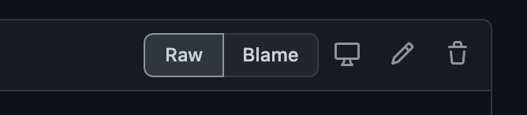
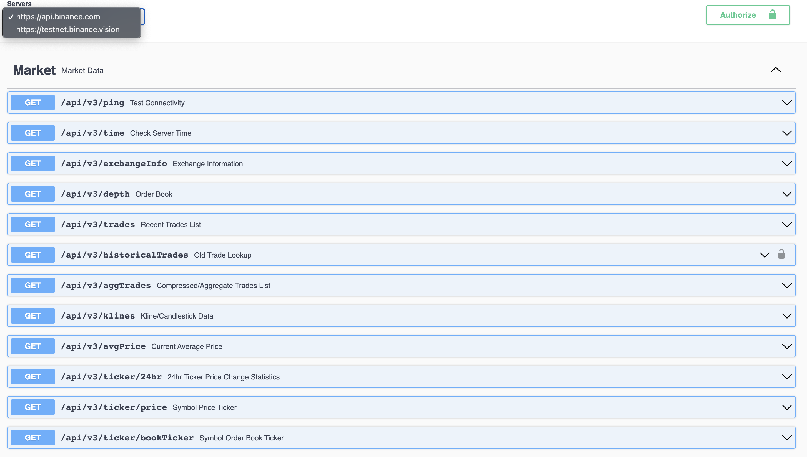

[](https://opensource.org/licenses/MIT)

# Binance Public API Swagger
[Swagger](https://swagger.io/) is a set of tools around OpenAPI Specification that can help you design, build, document and consume REST APIs.

Binance now offers a YAML collection file on [Binance Public Spot API](https://binance-docs.github.io/apidocs/spot/en/#change-log) to help developers' consulting of each endpoint through an interactive API documentation via Swagger UI.

- Supported APIs:
    - `/api/*`
    - `/sapi/*`
- Detailed parameters: mandatory or optional, descriptions and examples.
- Detailed responses: description, examples for different status codes and field comments.
- Endpoint Security Type
- Includes Tesnet's base URL.

## How to open Swagger UI
There's several options for the approach: 

- GitHub Pages:
    - You only have to open: https://binance.github.io/binance-api-swagger/

- Local UI instance:
    1. Install [Docker](https://docs.docker.com/get-docker/)
    2. Run locally:
        ```bash
        ./start.sh
        ```
    3. Open http://localhost:8080

- Swagger Inspector:
    1. Open YAML file in GitHub and click "Raw":
        <p align="left"></p>
    2. Copy and use previous step's URL in https://inspector.swagger.io/.

- IDE (Integrated Development Environment):
    - There's available plugins that can be used to preview Swagger UI.

- Swagger Hub:
    - https://app.swaggerhub.com/apis/binance_api/BinanceSpotAPI/1.0
    - You can also explore the `Export` section to export as Client SDK, Server Stub or Documentation in multiple languages.

## Swagger UI Preview
<p align="center"></p>

## Limitations
- Futures and Vanilla Options APIs are not supported:
    - `/fapi/*`
    - `/dapi/*`
    - `/vapi/*`

- CORS restrictions: Using Swagger UI beyond as API Documentation consulting, i.e, by actually trying out requests can result in invalid responses for endpoints requiring API Key (requests with header `X-MBX-APIKEY`). Swagger Inspector doesn't have this limitation.

- No integration of automated generation for dynamic parameters, such as `signature` and `timestamp`.
    
## Contributing
Contributions are welcome!<br>
If you've found an issue within this project, please open an issue to discuss what you would like to change.<br>
If it's an issue with the API, please open a topic at our [Binance API Community Forum](https://dev.binance.vision/).